# Sails.js

[Sails.js](http://sailsjs.org) is a powerful web framework that auto-generates REST APIs and the socket layer simultaneously.

Follow the [Getting Started](https://github.com/balderdashy/sails-docs/blob/master/getting-started/getting-started.md) docs to get started with Sails.

<table border=1>
 <tr>
 <td>Intro to Sails.js (00:14:44)<br/>
<a href="http://www.youtube.com/watch?feature=player_embedded&v=GK-tFvpIR7c" target="_blank">
</a></td>
 </tr>
</table>

## Setup `Cloud 9` Account

* Register a free account on [Cloud 9](https://c9.io).

* On the `Cloud 9` dashboard, click `CREATE NEW WORKSPACE` and select `Create a New Workspace`.

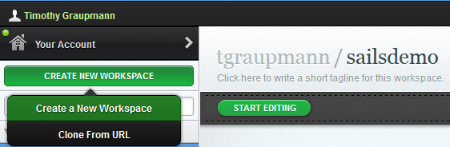

* Name your `workspace`. Select `Hosted` hosting with a `Node.js` service. Click the `CREATE` button. The create process runs for about 5 minutes... 

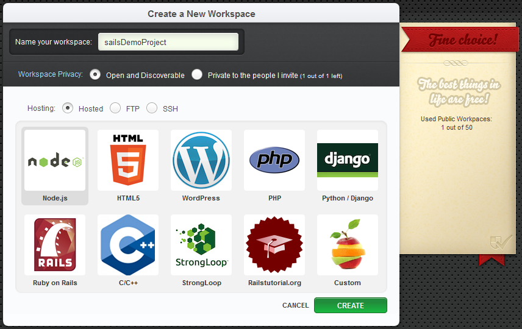

## How to Setup `Sails.js` on `Cloud 9`.

* In the `dashboard` click on the newly created `workspace` and click `START EDITING`.

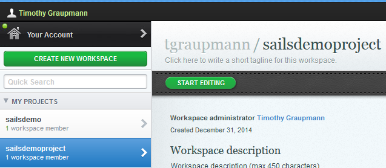

* Open a new `Terminal Window`.

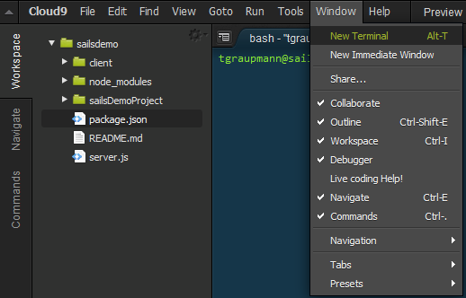

* Install `Sails.js` via the `Terminal Window`. The `NPM` package manager will install sails globally with the `-g` option.

`
sudo npm -g install sails
`

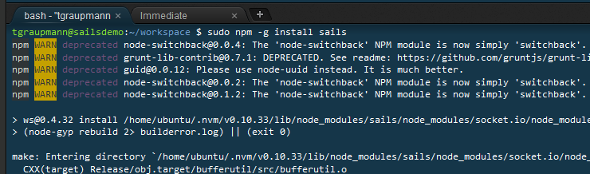

* Create a new `Sails.js` project.

```
sails new sailsDemoProject
```

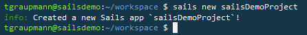

* Change to the project folder and start the `Sails.js` server.

```
cd sailsDemoProject/
sails lift
```

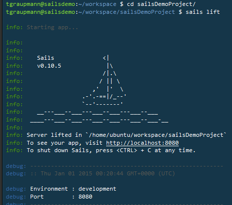

* Find `server.js` within your project, right-click and choose `Run`.

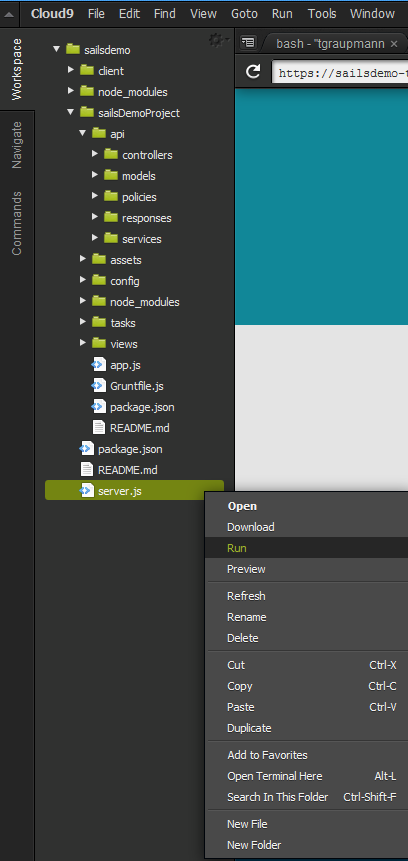

* Running `server.js` will display the link to browse the project.

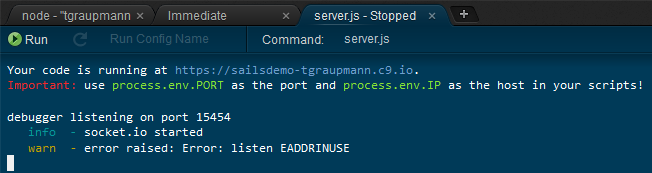

* Entering the link in the preview browser will display the project.


## Create Leaderboards Demo

Any game that has scoring will likely have a leaderboards feature. Here's how you can make a leaderboard in `Sails.js`.

* In the terminal, create a demo project. Switch to the project directory and restart `Sails.js`.

```
sails new leaderboardDemo
cd leaderboardDemo
sails lift
```

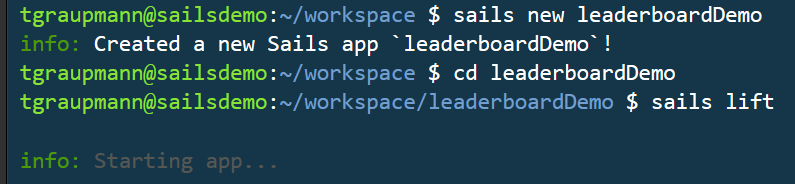

* Preview the page to confirm `Sails.js` has loaded.

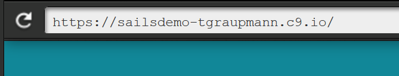

* In the terminal create a `leaderboard` api model and restart `Sails.js`.

```
sails generate api leaderboard
sails lift
```

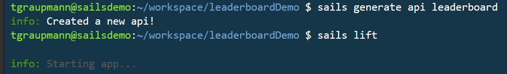

* The `Leaderboard.js` API model will be generated.

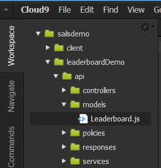

* Preview the leaderboard API page to verify the API has been created. The result set will be empty at first.

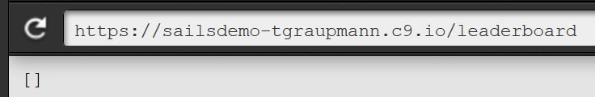

* Add records to the leaderboard data by hitting the API create page. More details are available on the page [Create a record](http://sailsjs.org/#/documentation/reference/blueprint-api/Create.html) in the `Blueprint API`.

```
https://sailsdemo-tgraupmann.c9.io/leaderboard/create?name=timg&score=10
```

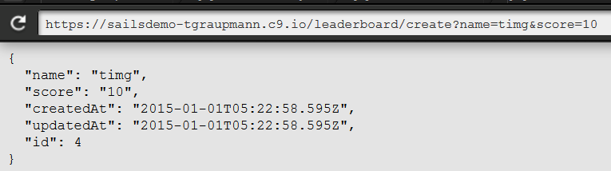

* The leaderboard page will show data has been added.

```
https://sailsdemo-tgraupmann.c9.io/leaderboard
```

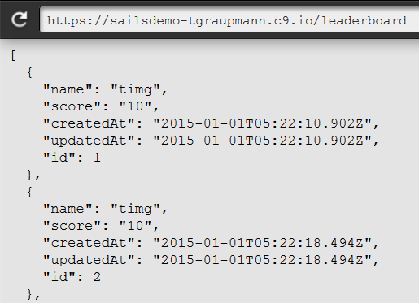

* Limit list to `10` records and sort by a descending `Score`.

```
https://sailsdemo-tgraupmann.c9.io/leaderboard?limit=10&sort=score%20DESC
```

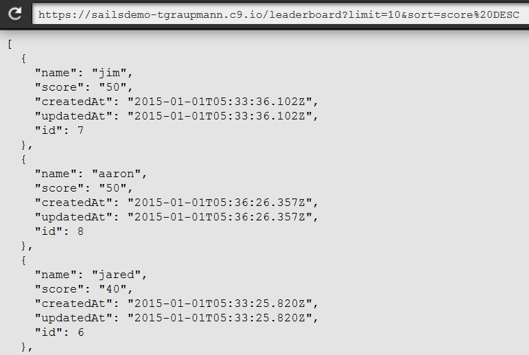

* If two people have the same score, sort by id.

```
https://sailsdemo-tgraupmann.c9.io/leaderboard?limit=10&sort=score%20DESC%20id%20ASC
```

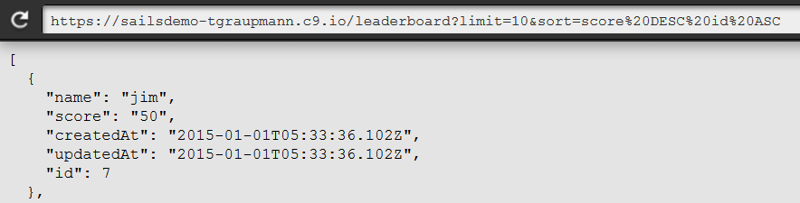

* If two people have the same score, sort by `createdAt`.

```
https://sailsdemo-tgraupmann.c9.io/leaderboard?limit=10&sort=score%20DESC%20createdAt%20ASC
```

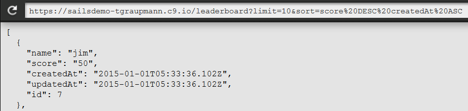

* To sort `Score` values properly change the `leaderboard model` attribute field for `Score` to use an `integer` type. Otherwise the `Score` values would sort in `String` order which is not ideal.

```
module.exports = {
  attributes: {
    name:{type:'string'},
    score:{type:'integer'}
  }
};
```

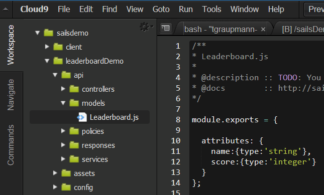

* Destroy will remove a record using the "id" field. More details are available on the page [Destroy a record](http://sailsjs.org/#/documentation/reference/blueprint-api/Destroy.html) in the `Blueprint API`.

```
https://sailsdemo-tgraupmann.c9.io/leaderboard/destroy?id=1
```

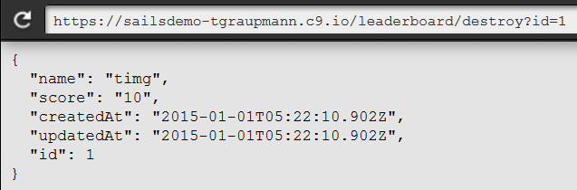

## Accessing Leaderboard Data from Unity

The [UnitySailsLeaderboard](https://github.com/tgraupmann/tagenigma-examples/tree/master/UnitySailsLeaderboard) example reads the `Sails.js` leaderboard data to display using the new Unity 4.6 UI.

* Be sure to inspect the `LeaderboardManager` and in the inspector set the `Cloud9` fields for your `Username` and `Project Name`. 

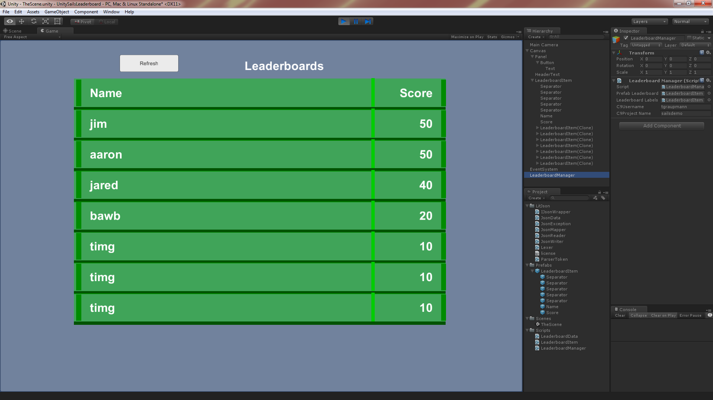
