# Setup For Fuse CC
---


## Quick Links
---

<a target="_blank" href="https://www.assetstore.unity3d.com/en/#!/content/54366">[Setup For Fuse CC]</a> is available in the Unity Asset Store.

Publisher: <a target="_blank" href="http://tagenigma.com/blog">[The Development Blog of Tim Graupmann]</a>


## Feedback
---

Send your questions, feedback, or feature requests to [support@theylovegames.com](mailto:support@theylovegames.com).


## Audience
---

Anyone who wants to use [Adobe Fuse CC](http://www.adobe.com/products/fuse.html) to create characters and wants to use those chracters in [Unity](http://unity3d.com/) can use this package.

Anyone who used an existing character from [Mixamo.com](http://mixamo.com) and added the `Scary Zombie Animation Pack` to their character can use this package.

Anyone who uploaded models to [Mixamo.com](http://mixamo.com) and added the `Scary Zombie Animation Pack` to their character can use this package.


## Compatibility
---

This package is targeted for Unity 5.3.1 or better.

This package extends the Unity editor.

This package is compatible with [Adobe Fuse CC](http://www.adobe.com/products/fuse.html).

This package is compatible with animated models from [Mixamo](http://mixamo.com).

This package is compatible with [Oculus Rift DK1](https://developer.oculus.com/downloads/game-engines/0.1.3.0-beta/Oculus_Utilities_for_Unity_5_SDK_Examples/).

This package is compatible with [RAIN AI for Unity](https://www.assetstore.unity3d.com/en/#!/content/23569). 

This package is compatible with [UFPS : Ultimate FPS](https://www.assetstore.unity3d.com/en/#!/content/2943).


## What is in this package?
---

This package includes editor scripts that provide automatic setup via add menu items.

This package includes animated models that were created in `Adobe Fuse CC`.


## Tutorials
---

You will find detailed tutorial videos on our YouTube channel in the [Setup For Fuse CC Playlist](https://www.youtube.com/playlist?list=PL4mjXeDqRBMSgTOKGb8jpQ0tjgMV53VvN).

<table border=1>
 <tr>
 <td>Adobe Fuse CC to Unity UFPS (00:16:15)<br/>
<a href="http://www.youtube.com/watch?feature=player_embedded&v=L9MCGwRTlbY" target="_blank">
</a></td>
 <td>Mixamo to Unity (00:02:11)<br/>
<a href="http://www.youtube.com/watch?feature=player_embedded&v=e5WgVEkMk3g" target="_blank">
</a></td>
 </tr>
 <tr>
 <td>Import RAIN AI for Unity into Unity (00:00:56)<br/>
<a href="http://www.youtube.com/watch?feature=player_embedded&v=r8BoYJPc84E" target="_blank">
</a></td>
 <td>Set up a Waypoint Route in RAIN AI for Unity (00:08:24)<br/>
<a href="http://www.youtube.com/watch?feature=player_embedded&v=30rb5Ihphx4" target="_blank">
</a></td>
 </tr>
 <tr>
 <td>Mixamo to Rain AI For Unity Waypoint Routes (00:03:49)<br/>
<a href="http://www.youtube.com/watch?feature=player_embedded&v=mLWW4GwG3Pw" target="_blank">
</a></td>
 <td>Quick RAIN Setup for Mixamo with Scary Zombie Pack AI (00:04:39)<br/>
<a href="http://www.youtube.com/watch?feature=player_embedded&v=h1cVxDnAUlE" target="_blank">
</a></td>
 </tr>
 <tr>
 <td>Scary Zombie Pack AI - Mixamo / Rain AI / UFPS Setup Automation (00:03:22)<br/>
<a href="http://www.youtube.com/watch?feature=player_embedded&v=7YdKXNHtlJI" target="_blank">
</a></td>
 <td></td>
 </tr>
</table>


## Example Scenes
---

Example scenes are located in `Assets/SetupForFuseCC/Scenes`.

Example Scene `RainUFPSWaypoints` - This example scene shows `RAIN` characters running around a `Navigation Mesh` cycling between waypoints. `RAIN` characters have a `Visual Sensor` and will detect players with a `Visual Aspect`. `RAIN` characters chase the player while in visual range. `RAIN` characters will attack the player when close enough. `RAIN` must be imported and enabled before opening this scene. `UFPS` must be imported and enabled before opening this scene.

Example Scene `NavMeshUFPSWaypoints` - This example scene shows `NavMesh Agents`  running around a terrain with obstacles and cycling between waypoints. `NavMesh Agents` have a `Visual Sensor` and will detect players with a `Visual Aspect`. `NavMesh Agents` chase the player while in visual range. `NavMesh Agents` will attack the player when close enough. `UFPS` must be imported and enabled before opening this scene.


## Dependencies

Before opening the example scenes, be sure to enable `Oculus` and/or `RAIN` and/or `UFPS` as applicable.

Some layers and tags are needed before opening the example scenes.


### Layers

Be sure that the layers exist for `Ground` and `Enemy`.

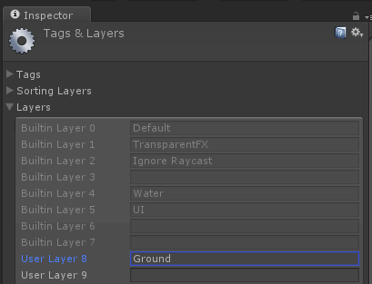


### Tags

Be sure that the tags exist for `Obstacle` and `Player` that the `RAIN` example scene will use.


### Enable VR Headsets
---

This package has been tested with the `Oculus DK1` and `Samsung GearVR`.

This package is compatible with [Oculus Utilities for Unity 5 SDK Examples](https://developer.oculus.com/downloads/game-engines/0.1.3.0-beta/Oculus_Utilities_for_Unity_5_SDK_Examples/).

The [Oculus Runtime for Windows](https://developer.oculus.com/downloads/pc/0.8.0.0-beta/Oculus_Runtime_for_Windows/) should be installed.

The `Oculus Utilities for Unity 5 SDK Examples` package must be imported before support is enabled.

To enable support, add `OCULUS_SDK` to the [Platform Custom Defines](http://docs.unity3d.com/Manual/PlatformDependentCompilation.html).

Multiple `Platform Custom Defines` are supported and are separated with a semicolon while the order of the items are not important. I.e.

```
OCULUS_SDK;UFPS;RAIN_AI
```

After support is enabled, `Oculus` submenu items will appear within the `Fuse` menu.

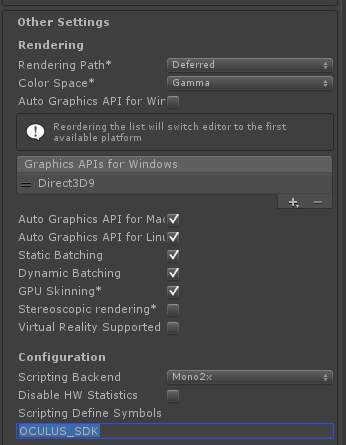

Copy the `ProjectSettings.asset` from the `Oculus SDK` into your `ProjectSettings` folder to provide the resolutions needed for the `Oculus`. If this step is skipped, the `Editor` will crash on start.

Copy the `InputManager.asset` from the `Oculus SDK`  into your `ProjectSettings` folder to provide support for a `wired XBOX 360 controller`. The left-stick will control movement. The right-stick will control the horizontal look.


### Enable RAIN AI for Unity
---

This package is compatible with [RAIN AI for Unity](https://www.assetstore.unity3d.com/en/#!/content/23569). 

The `RAIN AI for Unity` package must be imported before support is enabled.

To enable support, add `RAIN_AI` to the [Platform Custom Defines](http://docs.unity3d.com/Manual/PlatformDependentCompilation.html).

Multiple `Platform Custom Defines` are supported and are separated with a semicolon while the order of the items are not important. I.e.

```
OCULUS_SDK;UFPS;RAIN_AI
```

After support is enabled, `Fuse` submenu items will appear within the `RAIN` menu.

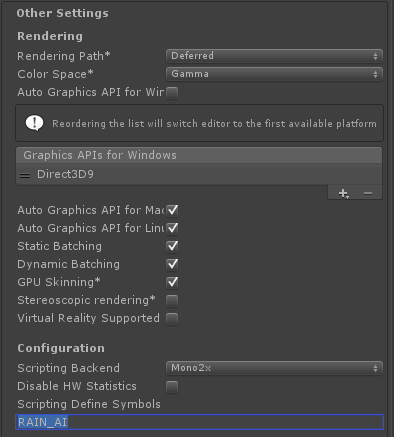


### Enable UFPS : Ultimate FPS
---

This package is compatible with [UFPS : Ultimate FPS](https://www.assetstore.unity3d.com/en/#!/content/2943).

The `UFPS` package must be imported before support is enabled.

To enable support, add `UFPS` to the [Platform Custom Defines](http://docs.unity3d.com/Manual/PlatformDependentCompilation.html).

Multiple `Platform Custom Defines` are supported and are separated with a semicolon while the order of the items are not important. I.e.

```
OCULUS_SDK;UFPS;RAIN_AI
```

After support is enabled, `UFPS` submenu items will appear within the `Fuse` menu.

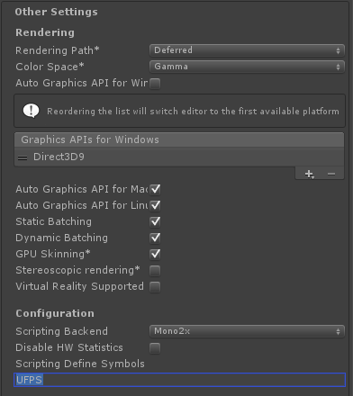


## Fuse CC
---

This package supports models created in [Adobe Fuse CC](http://www.adobe.com/products/fuse.html). `Fuse CC` is part of `Adobe Creative Cloud`. Design a character and then click the `Save to Mixamo` button to upload the character to the `Mixamo` website for auto-rigging and animation retargeting.

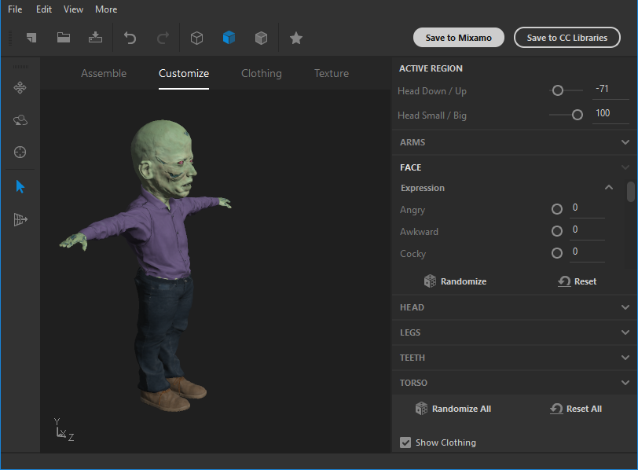


## Mixamo
---

[Mixamo](http://mixamo.com) has a collection of characters that can be animated with animation packs and then downloaded into `Unity`.


### Scary Animation Pack

This package supports `Mixamo` models that have the `Scary Animation Pack` applied. Be sure to check the `In Place` option for the animations in the pack to maximize compatibility.

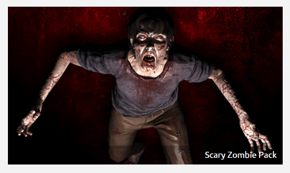

## Oculus Rift DK1

Be sure to [enable Oculus](Setup-For-Fuse-CC.md#user-content-enable-oculus-rift-dk1).

The menu item `Fuse->Set Oculus Rift DK1 [First Person Camera]` automatically creates the `OVRPlayerController GameObject` in the scene and sets up the main camera for the `Oculus`.

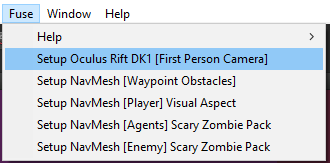

The `OVRPlayerController GameObject` has a default `Character Controller`, camera, and headtracking setup.


After hitting `Play`, the scene should display in the `Oculus Rift DK1`, headtracking, and controller input should be working.

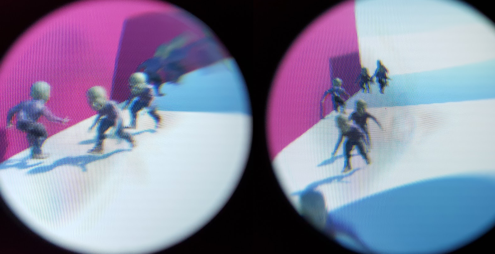


## Unity Built-in NavMesh Agents
---

### Getting Started


#### Create a New Scene

Start with a new scene and save the scene. A scene has to be saved to bake a `NavMesh`.

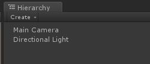


#### Create Waypoint Obstacles

The menu item `Fuse->Setup NavMesh [Waypoint Obstacles]` automatically creates a terrain with obstacles and waypoints. Obstacles show that the `NavMesh Agents` can navigate the `NavMesh` while patrolling a set of `Waypoints`.

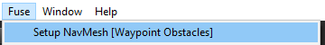

Terrain provides a floor to walk on. Obstacles are a set of cubes shaped like buildings spaced apart to give room for the `NavMesh Agents` to avoid. The obstacles are colored to make navigating the scene easy while inspecting `NavMesh Agents`. The `NavMeshAgentTargets` are a set of `GameObjects` to be used as patrol `Waypoints`.

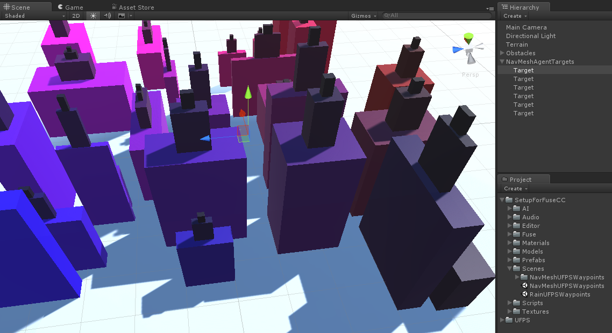


#### Setup the UFPS Player

The menu item `Fuse->Setup NavMesh [UFPS Player]` is only available when `UFPS` is enabled. The menu item creates a `UFPS` player with a `Visual Aspect` for `NavMesh Agents` to sense. The `UFPS` player has a `first-person` controller and is capable of running around the obstacle course. The `UFPS` has the damage handlers, colliders, and a starting inventory already setup. Since `UFPS` players have their own cameras, the default `Main Camera` is disabled. At this point, the player can run around the scene and shoot.

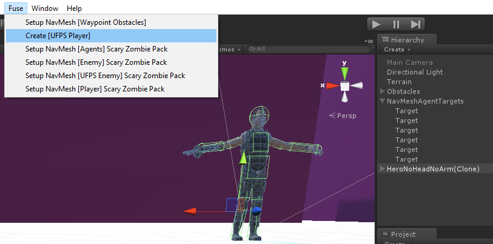


#### Setup the Player

The menu item `Fuse->Setup NavMesh [Player] Visual Aspect` adds a `Visual Aspect` to the player so that `NavMesh Agents` can detect the player. This can be used on `UFPS` players or generically on something like the `Standard Assets` where a `Character Controller` was used. A `Visual Aspect` will work for a `first-person` or `third-person` perspective controller.

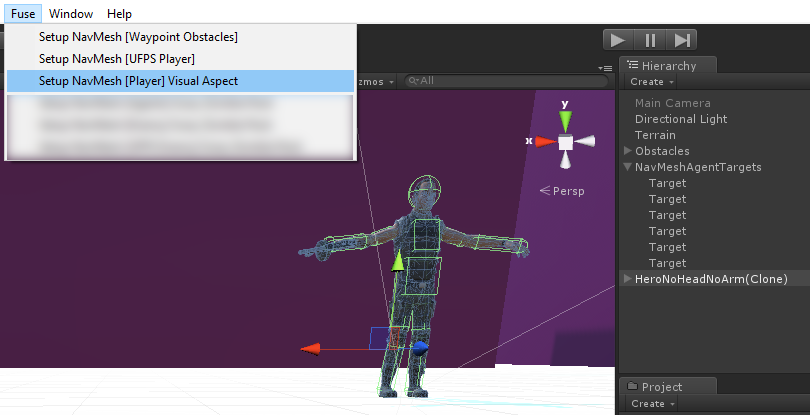


#### Setup NavMesh Agents With Scary Zombie Pack

The menu item `Fuse->Setup NavMesh [Agent] Scary Zombie Pack` can only be used when the main `Mixamo` character model is selected. The menu item will automatically generate an `Animator Controller` for the `Mixamo` character that is compatible with the `Scary Zombie Pack` from `Mixamo`. The `Animator Controller` will be created in the same folder as the `Mixamo` character. The menu item will apply some material fixes on the `Mixamo` model.

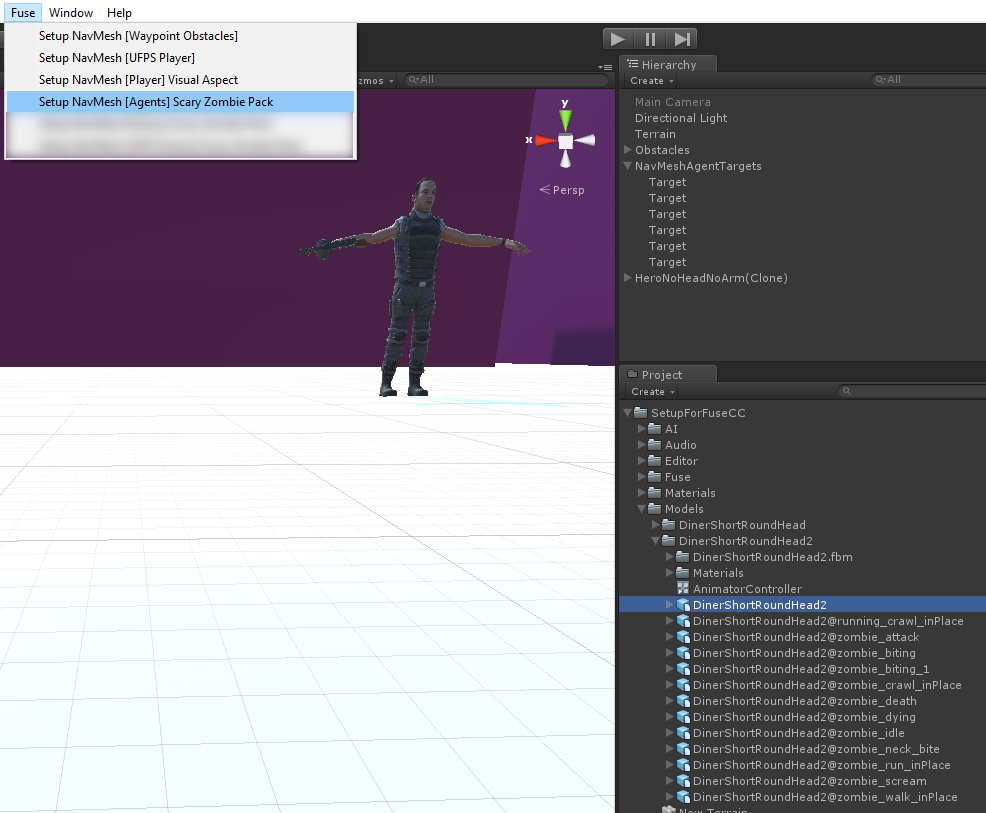


If the `Mixamo` character has an existing `Animator Controller` the editor will prompt before replacing it.

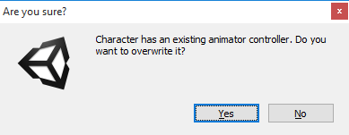


A `GameObject` named `NavMeshAgents` will be added to the scene, if missing, which holds the templates for `NavMesh Agents` that will be spawned. A `GameObject` named `NavMeshAgentSpawners` will be added to the scene, if missing, which holds the spawner instances for the `NavMesh Agents`. The spawners control the rate at which the agents are spawned. New agents will be spawned at the spawner locations. Templates should be deactivated before hitting play. A template might become unspawnable if it gets destroyed by dying if it was accidentally activated in `PLAY` mode.

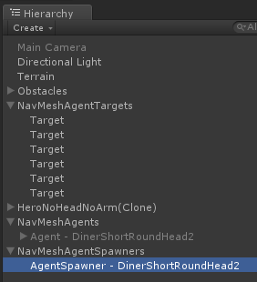


When the `Animator Controller` was generated, the menu item automatically scanned the Mixamo model animations to automatically create all the state transitions. The menu item also auto generated the `Mechanim` parameters used in the state diagram. The `Animator Controller` is already properly referenced by the `NavMesh Agent`.

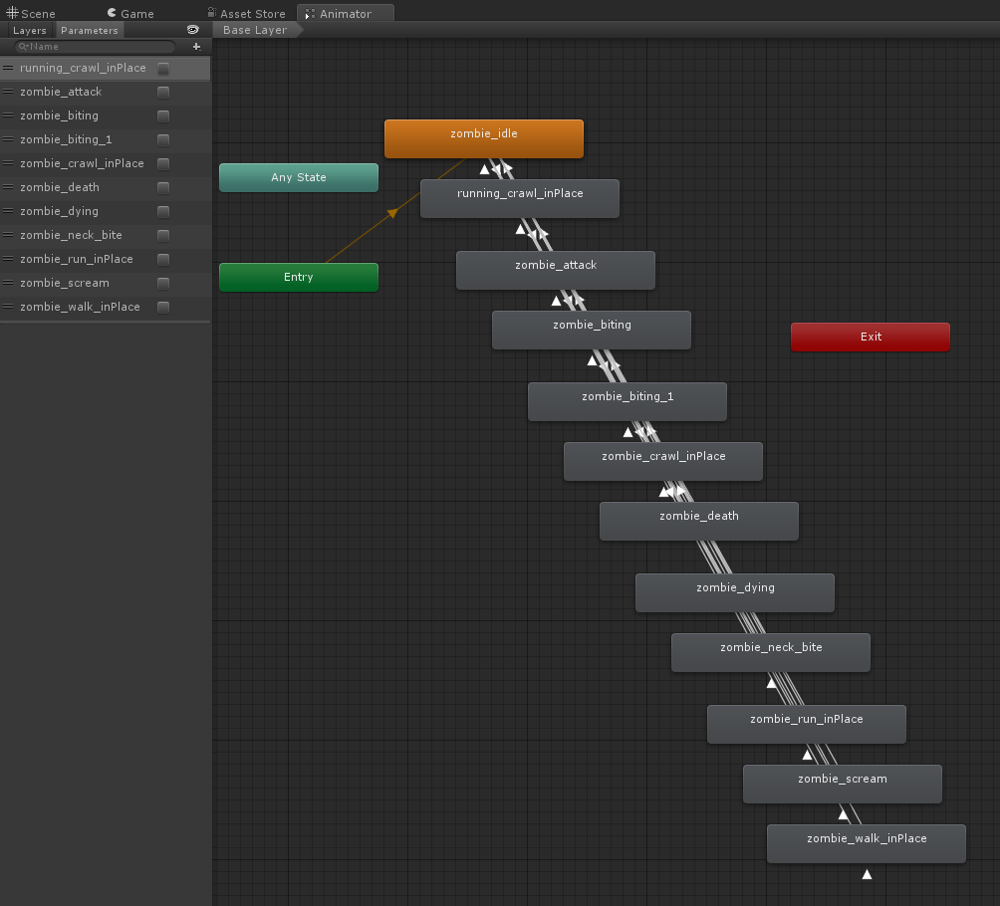


#### Setup NavMesh Agent Templates

The menu item `Fuse->Setup NavMesh [Enemy] Scary Zombie Pack` should only be run on a `NavMesh Agent` template. The menu item performs a subset of setup tasks from the previous item, excluding generating the `Animator Controller`, excluding the material fixes, and excluding creating the spawn items. The menu item adds a `Visual Sensor` so that a `Zombie` can find the `Player`. The menu item also adds a `Capsule Collider` to the spine of the `NavMesh Agent`. The below image has the template enabled only for documentation purposes. `NavMesh Agent` templates should be deactivated to be used properly. 

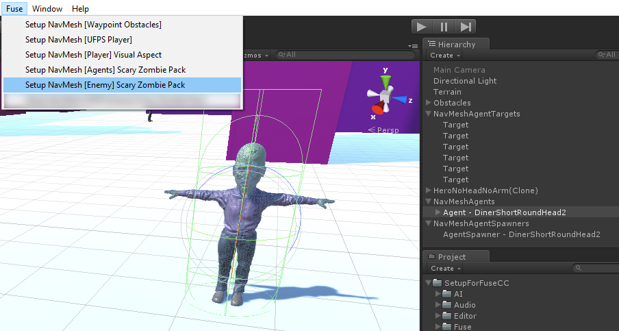


#### Setup NavMesh Agents for UFPS

The menu item `Fuse->Setup NavMesh [UFPS Enemy] Scary Zombie Pack` should only be run on a `NavMesh Agent` template. The menu item adds a `Damage Handler` so that the `Zombie` can be damaged by the `UFPS Player`. The menu item will only display if `UFPS` is enabled. The below image has the template enabled only for documentation purposes. `NavMesh Agent` templates should be deactivated to be used properly. 

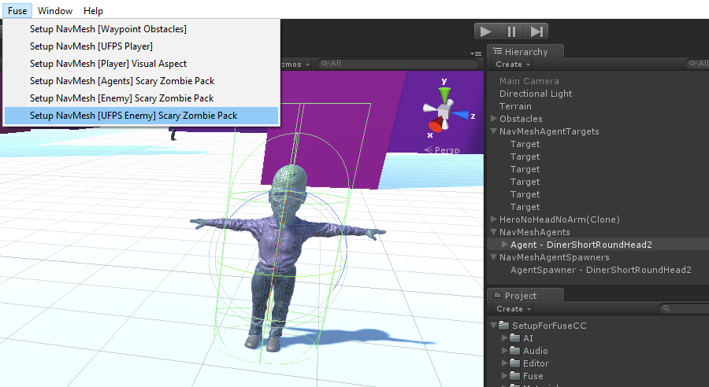


#### NavMesh Agent Patrols

At this point, the `NavMesh Agents` will cycle between their respective waypoints.

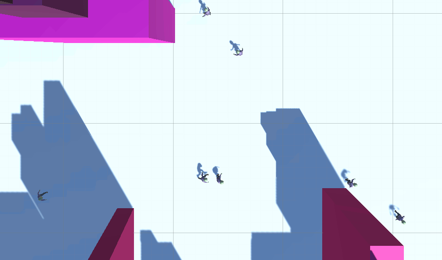


If the `NavMesh Agents` sense a `Visual Aspect` they will chase and attack their target.

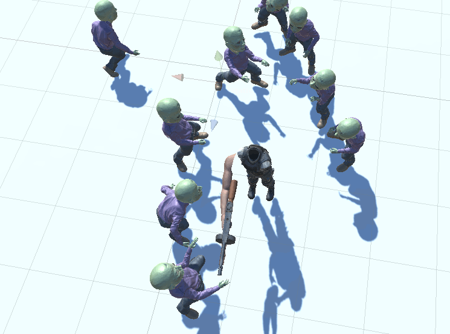


## RAIN AI for Unity
---


#### RAIN - Create a New Scene

Start with a new scene and save the scene.


#### RAIN - Tags

Add custom tags for `Obstacle` and `Player` that the `Navigation Mesh` will use.


#### RAIN - Add Ground Layer

The ground layer will be used on raycasts to ignore the ground layer.


#### RAIN - Create Waypoint Obstacles

The menu item `RAIN->Setup RAIN [Waypoint Obstacles]` automatically creates a terrain with obstacles and waypoints. Obstacles show that the `RAIN Agents` can navigate the `Navigation Mesh` while patrolling a set of `Waypoints`.

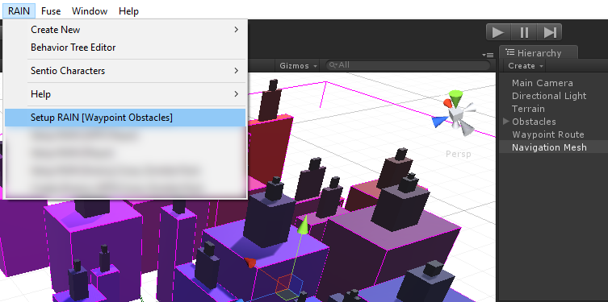


#### RAIN - Generate Navigation Mesh

Select `Navigation Mesh` in the scene and click the `Generate Navigation Mesh` button in the inspector. `RAIN` generates a `Navigation Mesh` that ignores `Player` tags and marks `Obstacle` tags as `unwalkable areas`.

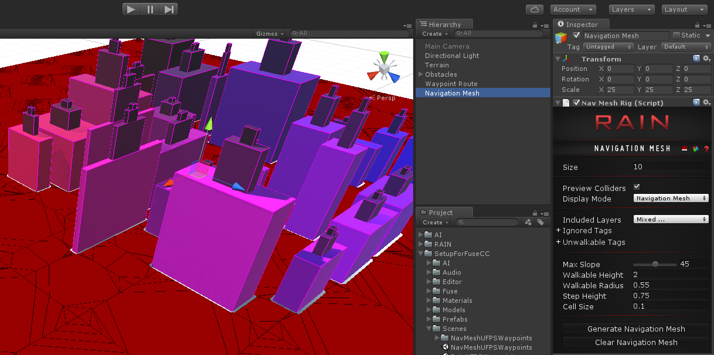


#### RAIN - Setup the UFPS Player

The menu item `RAIN->Setup RAIN [UFPS Player]` is only available when `UFPS` is enabled. The menu item creates a `UFPS` player with a `Visual Aspect` for `RAIN Agents` to sense. The `UFPS` player has a `first-person` controller and is capable of running around the obstacle course. The `UFPS` has the damage handlers, colliders, and a starting inventory already setup. Since `UFPS` players have their own cameras, the default `Main Camera` is disabled. At this point, the player can run around the scene and shoot.

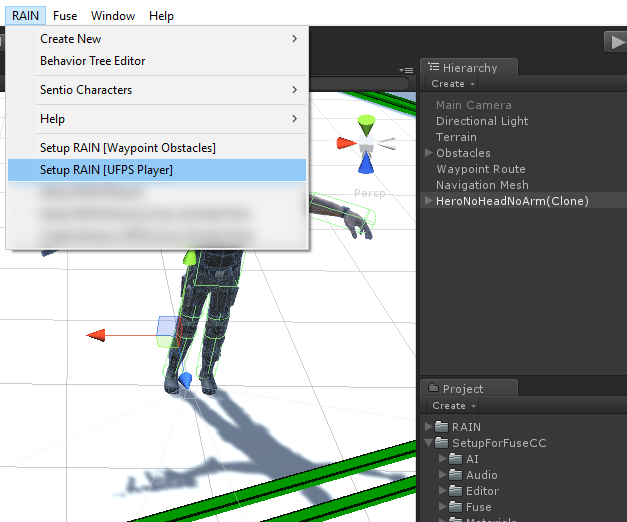


#### RAIN - Setup the Player

The menu item `RAIN->Setup RAIN [Player] Visual Aspect` adds a `Visual Aspect` to the player so that `RAIN Agents` can detect the player. This can be used on `UFPS` players or generically on something like the `Standard Assets` where a `Character Controller` was used. A `Visual Aspect` will work for a `first-person` or `third-person` perspective controller.

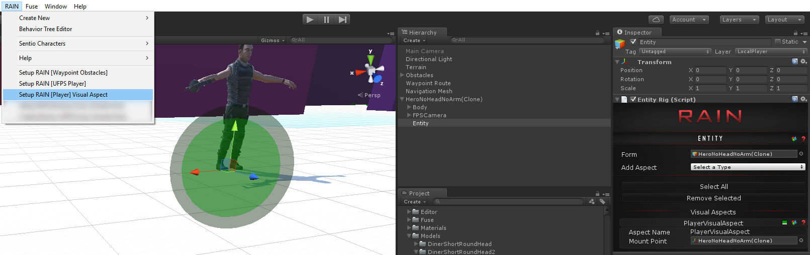


#### RAIN - Setup RAIN Agents With Scary Zombie Pack

The menu item `RAIN->Setup RAIN [Agent] Scary Zombie Pack` can only be used when the main `Mixamo` character model is selected. The menu item will automatically generate an `Animator Controller` for the `Mixamo` character that is compatible with the `Scary Zombie Pack` from `Mixamo`. The `Animator Controller` will be created in the same folder as the `Mixamo` character. The menu item will apply some material fixes on the `Mixamo` model.

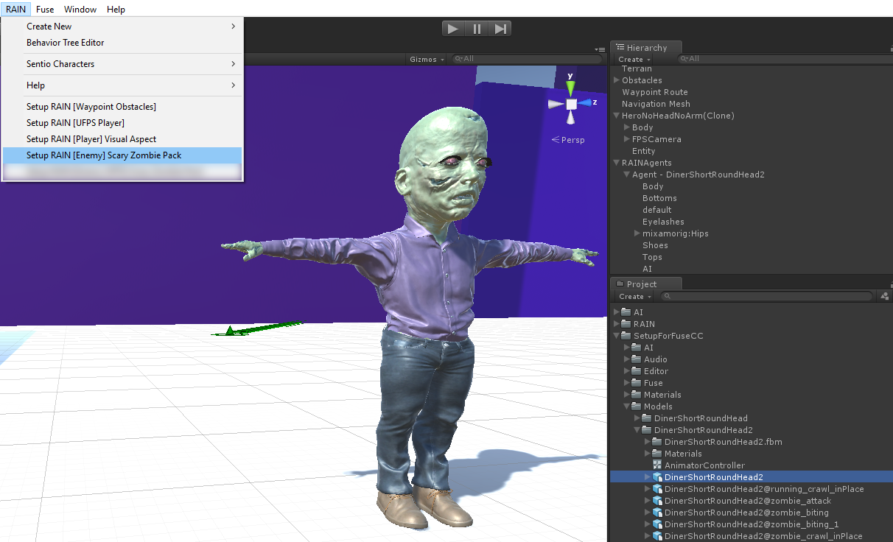


If the `Mixamo` character has an existing `Animator Controller` the editor will prompt before replacing it.


A `GameObject` named `RAINAgents` will be added to the scene, if missing, which holds the templates for `RAIN Agents` that will be spawned. A `GameObject` named `RAINAgentSpawners` will be added to the scene, if missing, which holds the spawner instances for the `RAIN Agents`. The spawners control the rate at which the agents are spawned. New agents will be spawned at the spawner locations. Templates should be deactivated before hitting play. A template might become unspawnable if it gets destroyed by dying if it was accidentally activated in `PLAY` mode.

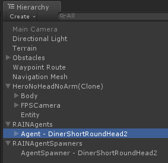


When the `Animator Controller` was generated, the menu item automatically scanned the Mixamo model animations to automatically create all the state transitions. The menu item also auto generated the `Mechanim` parameters used in the state diagram. The `Animator Controller` is already properly referenced by the `NavMesh Agent`.


#### RAIN - Setup RAIN Agents for UFPS

The menu item `RAIN->Setup RAIN [UFPS Enemy] Scary Zombie Pack` should only be run on a `RAIN Agent` template. The menu item adds a `Damage Handler` so that the `Zombie` can be damaged by the `UFPS Player`. The menu item will only display if `UFPS` is enabled. The below image has the template enabled only for documentation purposes. `RAIN Agent` templates should be deactivated to be used properly.

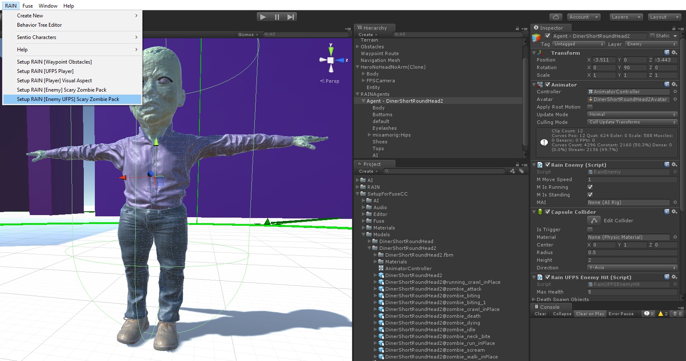


#### RAIN - RAIN Agent Patrols

At this point, the `RAIN Agents` will cycle between their respective waypoints. The player will be chased and attacked if the `RAIN Agent` senses the player. The `RAIN Behaviour Editor` will show the active `RAIN` state in the `Behaviour Tree` when the `RAIN Agent` is selected in the inspector.

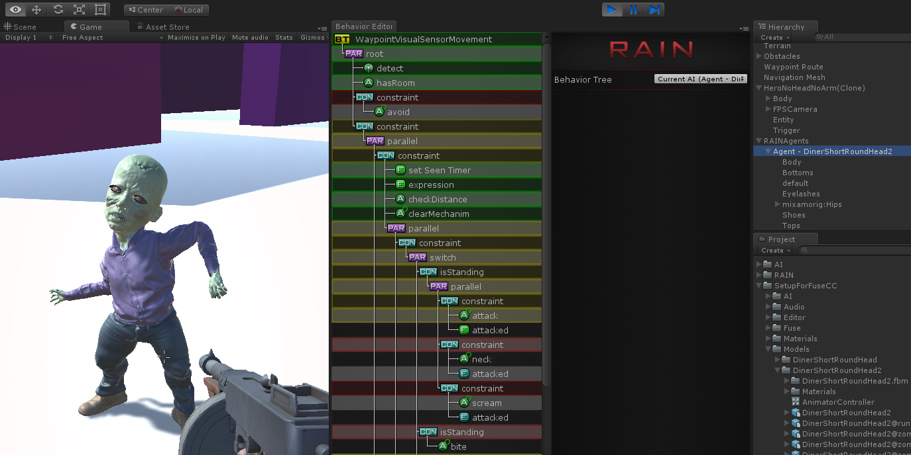


## Bug Fixes

Some 3rd party packages have some bug fixes yet to be published.


### UFPS

UFPS has some bug fixes that have yet to be incorporated into the release version. The following fixes correspond to `UFPS 1.5.2` and `UFPS 1.6`.


#### Cursor Handling

In `UFPS`, pressing `ESC` exits FPS mode and shows the cursor in the editor. This fix gives better `Cursor` handling in Unity 5.3.1 on Windows 10. Here's an enhancement for the `LockCursor` property in `vp_Utility`.

`Assets\UFPS\Base\Scripts\Core\Utility\vp_Utility.cs`

```
	/// <summary>
	/// shows or hides the mouse cursor in a way suitable for the
	/// current unity version
	/// </summary>
	public static bool LockCursor
	{

		// compile only for unity 5+
		#if (!(UNITY_4_6 || UNITY_4_5 || UNITY_4_3 || UNITY_4_2 || UNITY_4_1 || UNITY_4_0 || UNITY_3_5))
		get
		{
			return ((Cursor.lockState == CursorLockMode.Locked) ? true : false);
		}
		set
		{
			// toggling cursor visible and invisible is currently buggy in the Unity 5
			// editor so we need to toggle brute force with custom arrow art
			#if UNITY_EDITOR
				Cursor.SetCursor((value ? InvisibleCursor : VisibleCursor), Vector2.zero, CursorMode.Auto);
			#endif
            // running in a build so toggling visibility should work fine
			Cursor.visible = !value;
			Cursor.lockState = (value ? CursorLockMode.Locked : CursorLockMode.None);
		}
#else
		// compile only for unity 4.6 and older
		get { return Screen.lockCursor; }
		set { Screen.lockCursor = value; }
#endif

	}
```


#### Player Inventory Null Checking

`UFPS` didn't expect some things to be called in edit mode. Here's a fix to add a null check in the player inventory script. Find the `Reset` method on `vp_PlayerInventory`.

`Assets\UFPS\Base\Scripts\Gameplay\Player\vp_PlayerInventory.cs`

```
	/// <summary>
	/// Reset the player inventory
	/// </summary>
	public override void Reset()
	{

		m_PreviouslyOwnedItems.Clear();
		m_CurrentWeaponInstance = null;

		if (null != m_Misc &&
            !m_Misc.ResetOnRespawn)
			return;

		base.Reset();

	}
```


#### Player Inventory Wield Null Checking

Find the `TryWieldNewItem` method on `vp_PlayerInventory`. This adds missing null checks and notice this method uses the legendary `goto`.

`Assets\UFPS\Base\Scripts\Gameplay\Player\vp_PlayerInventory.cs`

```
    /// <summary>
	/// Try to wield an item
	/// </summary>
	protected virtual void TryWieldNewItem(vp_ItemType type, bool alreadyHaveIt)
	{

		bool haveHadItBefore = m_PreviouslyOwnedItems.ContainsKey(type);
		if (!haveHadItBefore)
			m_PreviouslyOwnedItems.Add(type, null);

		// --- see if we should try to wield a weapon because of this item pickup ---

		if (null != m_AutoWield &&
            m_AutoWield.Always)
			goto tryWield;

		if (null != m_AutoWield &&
            m_AutoWield.IfUnarmed && (WeaponHandler.CurrentWeaponIndex < 1))
			goto tryWield;

		if (null != m_AutoWield &&
            m_AutoWield.IfOutOfAmmo
			&& (WeaponHandler.CurrentWeaponIndex > 0)
			&& (WeaponHandler.CurrentWeapon.AnimationType != (int)vp_Weapon.Type.Melee)
			&& m_Player.CurrentWeaponAmmoCount.Get() < 1)
			goto tryWield;

		if (null != m_AutoWield &&
            m_AutoWield.IfNotPresent && !m_AutoWield.FirstTimeOnly && !alreadyHaveIt)
			goto tryWield;

		if (null != m_AutoWield &&
            m_AutoWield.FirstTimeOnly && !haveHadItBefore)
			goto tryWield;

		return;

	tryWield:

		if ((type is vp_UnitBankType))
			TryWield(GetItem(type));
		else if (type is vp_UnitType)
			TryWieldByUnit(type as vp_UnitType);
		else if (type is vp_ItemType)	// tested last since the others derive from it
			TryWield(GetItem(type));
		else
		{
			System.Type baseType = type.GetType();
			if (baseType == null)
				return;
			baseType = baseType.BaseType;
			if ((baseType == typeof(vp_UnitBankType)))
				TryWield(GetItem(type));
			else if (baseType == typeof(vp_UnitType))
				TryWieldByUnit(type as vp_UnitType);
			else if (baseType == typeof(vp_ItemType))
				TryWield(GetItem(type));
		}
		
	}
```


## Change Log
---

1.0 - Initial submission of package.


## Q & A
---

You can send comments/questions to [support@theylovegames.com](mailto:support@theylovegames.com) where your feedback will help us create new tutorials and features in order to improve the product.


## Roadmap
---

Upcoming Features:
* VR setup automation.
* Easy weapon setups
* Don't show shells on player/enemy colliders
* Support Pro Archer Animation Pack
* Add Bows and Arrows
