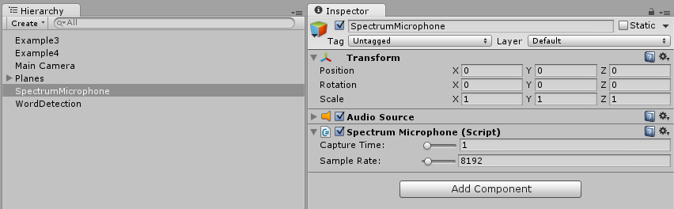
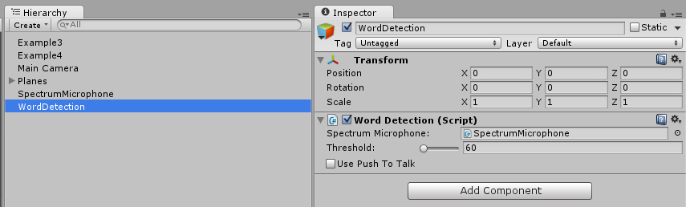
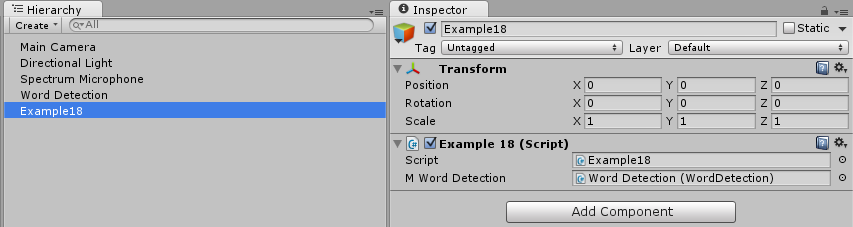
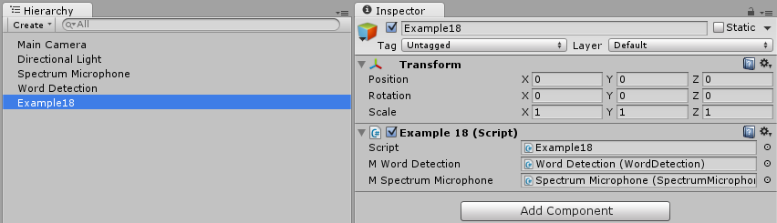
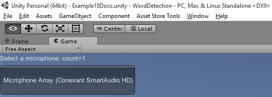
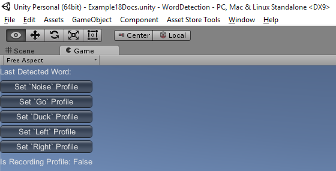

Word Detection
--------------


Quick Links
-----------

<a target=_blank href="https://www.assetstore.unity3d.com/#/content/4518">[Word Detection]</a> is available in the Unity Asset Store.

<a target=_blank href="http://forum.unity3d.com/threads/152178-Word-Detection-Verbal-Commands">[Unity Showcase Thread]</a>


<a target=_blank href="http://theylovegames.com">[They Love Games]</a>


Feedback
--------

Please post your feedback and feature requests in the forums:

http://forum.unity3d.com/threads/152178-Word-Detection-Verbal-Commands


Audience
--------

Anyone wanting to quickly add spoken words to their game play. Add word profiles at runtime and immediately

start detecting spoken words.


Compatibility
-------------

This project is targeted for Unity 3.5.5 or better.

iOS and Android device support can vary.


Hardware testing
----------------

(Android)

Nexus 10

Samsung Galaxy S III

(iOS)

iPad 2nd Generation


What is in this package?
------------------------

This package includes a four example scenes in addition to the word detection package.


Example Scene 1 - Spectrum Mic, captures raw wave data from the microphone and performs

spectrum analysis which is rendered to a texture via the Graph Plotter.

Clicking on the example node in the scene reveals that the plot resolution can be altered

via a slider in the custom inspector.


Example Scene 2 - Array Copy, a tweak to the first example, capturing raw data from the

microphone is held in a circular array. This example reorders the array to keep the mic

position at the end of the array.


Example Scene 3 - Material Offset, rather than doing copy operations, this uses the material

texture offset to offset the mic position without needing to shift the array. The custom

inspector provides a toggle for normalizing the plot graph.


Example Scene 4 - Word Detection, words can be added at runtime which are detected and the

WordDetection's DetectedEvent fires each time the detected word changes. The detection

threshold can be tweaked via the custom inspector of WordDetection. Lower numbers are

more precise. Higher numbers are less precise.


Example Scene 5 - Verbal Control, words can control the transformation of a cube


Example Scene 6 - Push to talk in order to issue commands


Example Scene 7 - Mechanim example uses Word Detection to change states


Example Scene 8 - Adds saving and loading profiles to file with a dialog


Example Scene 9 - Adds word navigation using word sets


Example Scene 10 - Adds verbal commands that control facial expressions


Example Scene 11 - Verbal commands control another hi-resolution head


Example Scene 12 - Verbal command control a low-resolution talking head


Example Scene 13 - Verbal commands control another low-res talking head


Example Scene 14 - Verbal commands control blend shapes


Example Scene 15 - Verbal commands control emotional states


Example Scene 16 - Verbal commands control goat media clip playback


Example Scene 17 - Verbal commands drive Character Controller input


Tutorials
---------

You will find detailed tutorial videos on our YouTube channel: http://www.youtube.com/playlist?list=PLEXfnMfl8Yrvr7ynEqdgYXrKzuAH5wtyf playlist.


Notes
-----

1. Add Spectrum Microphone to the scene via the menu GameObject->Create Other->Audio->Create Spectrum Microphone.

2. Add Word Detection to the scene via the menu GameObject->Create Other->Audio->Add Word Detection.

3. Custom inspectors are available to tweak both Spectrum Microphone and Word Detection game objects.


Change Log
----------

1.0 - Added a realtime spectrum microphone. Added audio word detection.

1.1 - Added Example5 verbal control demo

1.2 - Rewrote FFT library

1.3 - Downgraded to Unity 3.5.0

1.4 - Added example 6

1.5 - Added support for profile loading and saving. Added an example toggle for "Use Plotter" which disables example texture rendering when off.

1.6 - Added push to talk example

1.7 - Added mechanim example

1.8 - Upgraded to Unity 4.5.1. Added file save dialog for word profiles, word set navigation, and the control of facial expressions with word commands

1.9 - Added goat media clips with playback ties with word detection

1.10 - Word Detection can now drive a Character Controller

1.11 - Upgraded to Unity 5.1.2. Truncated some data files to reduce the core package size. Example data files can be downloaded from: [WordDetection_GoatMediaClips.unitypackage](https://github.com/tgraupmann/TAGENIGMA-Docs/blob/master/Word-Detection/Data/WordDetection_GoatMediaClips.unitypackage)

Q & A
-----

You can send comments/questions to support@theylovegames.com where your feedback will help us create new tutorials and features in order to improve the product.

# Getting Started

1) Start with a new Scene.

2) Create a `GameObject` called `Spectrum Microphone` and attach the `Spectrum Microphone` script. The default capture time is `1 second` and the default sampling rate is `8192`. Adding `Spectrum Microphone` will also add an `Audio Source` component. This script allows recording from the microphone and playing back sample recordings.



3) Create a `GameObject` called `Word Detection` and attach the `Word Detection` script. The default threshold is `60` and use push to talk is `off`. Drag the `Spectrum Microphone` from the Scene to the `Spectrum Microphone` field on the `Word Detection` script. This allows `Word Detection` to use the `Microphone` data.



4) At a minimum you'll need a script that has a word detection callback. Create an `Example18` GameObject in the scene and attach the `Example18` script. You can use your own script and GameObject name as you follow along. Be sure to set the `_mWordDetection` field with a reference to the `WordDetection` object in the scene. This script adds the initial `Noise` profile for filtering out background noise. Word profiles also have to be initialized before they can be used in detection.



```
using UnityEngine;

public class Example18 : MonoBehaviour
{
    /// <summary>
    /// Reference to the Word Detection object in the scene
    /// </summary>
    public WordDetection _mWordDetection = null;

    /// <summary>
    /// Create initial word set and subscribe to the word detection callback
    /// </summary>
    void Start()
    {
        if (null == _mWordDetection)
        {
            Debug.LogError("Missing meta reference to Word Detection");
            return;
        }

        // populate the word set
        _mWordDetection.Words.Add(new WordDetails() { Label = "Noise" });

        //subscribe detection event
        _mWordDetection.WordDetectedEvent += WordDetectedHandler;
    }

    /// <summary>
    /// Callback for word detected event
    /// </summary>
    /// <param name="sender"></param>
    /// <param name="args"></param>
    private void WordDetectedHandler(object sender, WordDetection.WordEventArgs args)
    {
    }
}
```

5) Expand the existing example to detect additional words. In the start event expand the set of words to detect.

```
    void Start()
    {
        if (null == _mWordDetection)
        {
            Debug.LogError("Missing meta reference to Word Detection");
            return;
        }

        // populate the word set

		// Background noise is the word profile we always want to ignore during detection
        _mWordDetection.Words.Add(new WordDetails() { Label = "Noise" });

		// Add a word to detect when saying "Go"
        _mWordDetection.Words.Add(new WordDetails() { Label = "Go" });

		// Add a word to detect when saying "Duck"
        _mWordDetection.Words.Add(new WordDetails() { Label = "Duck" });

		// Add a word to detect when saying "Left"
        _mWordDetection.Words.Add(new WordDetails() { Label = "Left" });

		// Add a word to detect when saying "Right"
        _mWordDetection.Words.Add(new WordDetails() { Label = "Right" });

        //subscribe detection event
        _mWordDetection.WordDetectedEvent += WordDetectedHandler;
    }
```

6) Add a string field to hold the last detected word. Add an OnGUI event to display the last detected word.

```
    /// <summary>
    /// Callback for word detected event
    /// </summary>
    /// <param name="sender"></param>
    /// <param name="args"></param>
    private void WordDetectedHandler(object sender, WordDetection.WordEventArgs args)
    {
        if (string.IsNullOrEmpty(args.Details.Label))
        {
            return;
        }

        _mLastDetectedWord = args.Details.Label;
    }

    /// <summary>
    /// Display event
    /// </summary>
    void OnGUI()
    {
        GUILayout.Label(string.Format("Last Detected Word: " + _mLastDetectedWord));
    }
```

7) Add a helper method to retrieve the word profile given the label of the `WordDetails`.

```
    private WordDetails GetWord(string label)
    {
        foreach (WordDetails details in AudioWordDetection.Words)
        {
            if (null == details)
            {
                continue;
            }
            if (details.Label.Equals(label))
            {
                return details;
            }
        }

        return null;
    }
```

8) The script needs access to the `SpectrumMicrophone` data so that recordings can be assigned to the word profiles. Be sure to drag the `SpectrumMicrophone` to the `_mSpectrumMicrophone` field on the `Example18` script.



```
public class Example18 : MonoBehaviour
{
    /// <summary>
    /// Reference to the spectrum microphone
    /// </summary>
    public SpectrumMicrophone _mSpectrumMicrophone = null;
}
```

9) Add a helper method for selecting the word detection `Microphone`.

```
    /// <summary>
    /// Show the available Microphones to select from
    /// </summary>
    private void ShowMicrophoneSelector()
    {
        GUILayout.Label(string.Format("Select a microphone: count={0}", Microphone.devices.Length));

        foreach (string device in Microphone.devices)
        {
            if (string.IsNullOrEmpty(device))
            {
                continue;
            }

            if (GUILayout.Button(device, GUILayout.Height(60)))
            {
                _mSpectrumMicrophone.DeviceName = device;
            }
        }
    }
```

10) When the scene starts, the user needs to select a `Microphone`. Just using the first `Microphone` is not ideal since most users will have multiple detected microphones and will need to select which one to use.



```
    void OnGUI()
    {
        if (string.IsNullOrEmpty(_mSpectrumMicrophone.DeviceName))
        {
            ShowMicrophoneSelector();
            return;
        }
        GUILayout.Label(string.Format("Last Detected Word: " + _mLastDetectedWord));
    }
```

11) When creating a word profile be sure that detection is being ignored.

```
    /// <summary>
    /// Indicates a profile is being recorded
    /// </summary>
    private string _mRecordingProfile = string.Empty;

    /// <summary>
    /// Callback for word detected event
    /// </summary>
    /// <param name="sender"></param>
    /// <param name="args"></param>
    private void WordDetectedHandler(object sender, WordDetection.WordEventArgs args)
    {
        if (!string.IsNullOrEmpty(_mRecordingProfile))
        {
            return;
        }

        if (string.IsNullOrEmpty(args.Details.Label))
        {
            return;
        }

        _mLastDetectedWord = args.Details.Label;
    }
```

12) Add a helper method to get the Microphone data to save in word profiles.

```
    /// <summary>
    /// Holds a copy of the microphone data
    /// </summary>
    private float[] _mMicrophoneData = null;

    /// <summary>
    /// Get the microphone data from the spectrum microphone
    /// </summary>
    /// <returns></returns>
    private float[] GetMicrophoneData()
    {
        int position = _mSpectrumMicrophone.GetPosition();
        int size = _mSpectrumMicrophone.CaptureTime * _mSpectrumMicrophone.SampleRate;
        float[] data = _mSpectrumMicrophone.GetData(0);

        if (null == _mMicrophoneData ||
            _mMicrophoneData.Length != size)
        {
            _mMicrophoneData = new float[size];
        }

        //shift array
        for (int index = 0, i = position; index < size; ++index, i = (i + 1) % size)
        {
            _mMicrophoneData[index] = data[i];
        }

        return _mMicrophoneData;
    }
```

13) Add a helper method for playing back recorded word profiles.

```
    /// <summary>
    /// Play back the audio clip of a word profile
    /// </summary>
    /// <param name="details"></param>
    private void PlayProfile(WordDetails details)
    {
        //play the audio
        if (null == details.Audio)
        {
            details.Audio = AudioClip.Create(string.Empty, details.Wave.Length, 1, _mSpectrumMicrophone.SampleRate, false);
        }
        details.Audio.SetData(details.Wave, 0);
        _mSpectrumMicrophone.GetComponent<AudioSource>().loop = false;
        _mSpectrumMicrophone.GetComponent<AudioSource>().mute = false;
        _mSpectrumMicrophone.GetComponent<AudioSource>().PlayOneShot(details.Audio);
    }
```

14) Add a helper method that displays a GUI button and when pressed assigns the profile for a word.

```
    /// <summary>
    /// Create a push to talk button that creates a word profile
    /// </summary>
    /// <param name="buttonLabel"></param>
    /// <param name="wordLabel"></param>
    /// <param name="currentEvent"></param>
	private void ShowButtonSetProfile(string buttonLabel, string wordLabel, Event currentEvent)
    {
        GUILayout.Button(buttonLabel);
        Rect rect = GUILayoutUtility.GetLastRect();
        if (null != currentEvent)
        {
            bool overButton = rect.Contains(currentEvent.mousePosition);
            if (Input.GetMouseButton(0))
            {
                if (overButton)
                {
                    _mRecordingProfile = wordLabel;
                }
            }
            else
            {
                if (_mRecordingProfile == wordLabel)
                {
                    WordDetails details = GetWord(_mRecordingProfile);
                    if (null != details)
                    {
                        details.Wave = GetMicrophoneData();
                        PlayProfile(details);
                    }
                    _mRecordingProfile = string.Empty;
                }
            }
        }
    }
```

15) The `WordDetails` profiles need to be set for the word detection event to start firing when those words are detected. Create buttons that will assign the word profiles for the set of words being detected.



```
    void OnGUI()
    {
        if (string.IsNullOrEmpty(_mSpectrumMicrophone.DeviceName))
        {
            ShowMicrophoneSelector();
            return;
        }
        // Get the current event to know when buttons are held
        Event currentEvent = Event.current;

        // Show the last detected word in a label
        GUILayout.Label(string.Format("Last Detected Word: " + _mLastDetectedWord));

        foreach (WordDetails details in _mWordDetection.Words)
        {
            ShowButtonSetProfile(string.Format("Set `{0}` Profile", details.Label), details.Label, currentEvent);
        }

        GUILayout.Label(string.Format("Recording Profile: {0}", _mRecordingProfile));
    }
```

# API

The word detection API provides a callback event for detected words.

```
        //subscribe detection event
        AudioWordDetection.WordDetectedEvent += WordDetectedHandler;
```

## Detected Word Score

The word detection system uses an event that fires when the word with the best score satisfies a match.

```
    /// <summary>
    /// Handle word detected event
    /// </summary>
    /// <param name="sender"></param>
    /// <param name="args"></param>
    void WordDetectedHandler(object sender, WordDetection.WordEventArgs args)
    {
    }
```

The `WordEventArgs` argument has a public field that includes the name of the detected word `args.Details.Label`.

The `WordEventArgs` argument has a score that identifies the strength of the match (larger score indicates better match) `args.Details.Score`. 
